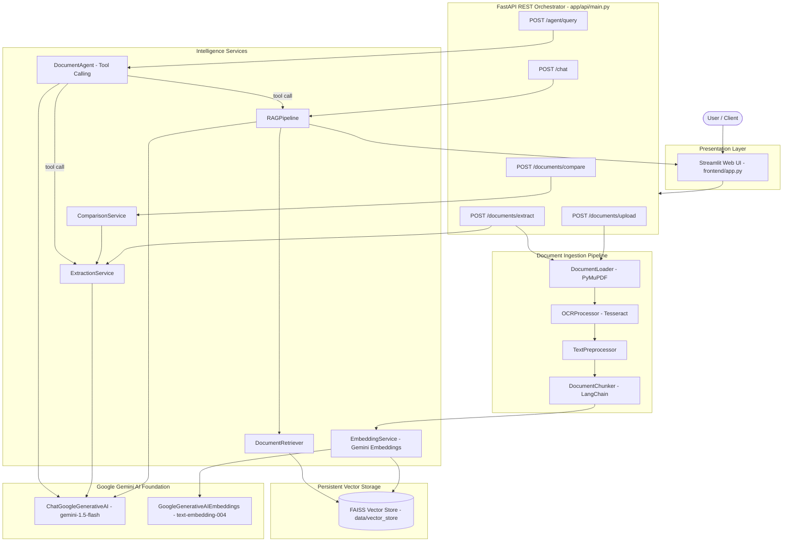

# DocuMind AI

**Intelligent Document Analysis & Agent Platform**

DocuMind AI is an enterprise-grade document intelligence platform that combines multimodal document ingestion, optical character recognition (OCR), retrieval-augmented generation (RAG), structured information extraction, autonomous tool-calling agents, and multi-document comparison. Built with **FastAPI**, **LangChain**, **Google Gemini**, **FAISS**, and **Streamlit**, it transforms complex, unstructured business documents (contracts, invoices, forms, deeds, and reports) into verifiable, structured insights with page-level citations.

---

## Table of Contents

- [Overview](#overview)
- [Key Features](#key-features)
- [Architecture](#architecture)
- [RAG Pipeline](#rag-pipeline)
- [Document Processing Pipeline](#document-processing-pipeline)
- [Structured Extraction](#structured-extraction)
- [Autonomous Tool-Calling Agent](#autonomous-tool-calling-agent)
- [Multi-Document Comparison](#multi-document-comparison)
- [Technology Stack](#technology-stack)
- [Project Structure](#project-structure)
- [Installation & Setup](#installation--setup)
- [Environment Configuration](#environment-configuration)
- [Running the Application](#running-the-application)
- [API Reference](#api-reference)
- [Example Usage](#example-usage)
- [Testing](#testing)
- [Evaluation Framework](#evaluation-framework)
- [Security & Best Practices](#security--best-practices)
- [Design Decisions](#design-decisions)
- [Limitations](#limitations)
- [Future Improvements](#future-improvements)
- [Screenshots & Demo](#screenshots--demo)
- [Resume Summary](#resume-summary)
- [License](#license)

---

## Overview

Traditional keyword search and standard "chat with PDF" wrappers fail when dealing with complex, multi-page business documents. They suffer from hallucinated answers, loss of formatting context, lack of page traceability, and inability to handle scanned images or perform structured attribute comparisons.

**DocuMind AI** solves these challenges by providing:
1. **Multimodal Ingestion**: Native text extraction from PDFs alongside OCR for scanned images (PNG, JPG, JPEG).
2. **Page-Aware Grounding**: Strict 1-based page attribution preserved throughout chunking, indexing, and LLM inference, ensuring every answer includes exact page citations.
3. **Structured Entity Extraction**: Pydantic schema validation powered by Google Gemini structured outputs to extract key-value fields with confidence scores.
4. **Deterministic Document Comparison**: Attribute normalization and discrepancy detection across multiple document versions.
5. **Autonomous Agent Reasoning**: Tool-calling agent capable of dynamically deciding between grounded semantic search and full-text structured extraction.

---

## Key Features

- 📄 **Multimodal Document Ingestion**: Fast native digital text parsing from multi-page PDFs using PyMuPDF (`fitz`).
- 🔍 **Tesseract OCR Integration**: Automated OCR fallback for scanned images and non-searchable document formats using Pillow and `pytesseract`.
- 🧹 **Conservative Text Preprocessing**: Strips non-printable control characters and normalizes whitespace while preserving legal terms, tables, numbers, dates, and currency symbols.
- ✂️ **Page-Aware Text Chunking**: Splits document pages using `RecursiveCharacterTextSplitter` while binding document IDs, filenames, and 1-based page numbers to every chunk metadata payload.
- 🧠 **Google Gemini Embeddings**: High-dimensional semantic embeddings generated via `models/text-embedding-004`.
- 🗂️ **Persistent FAISS Vector Indexing**: Local vector storage with cosine/L2 distance search, document filtering, and index serialization.
- 💬 **Citation-Backed RAG Q&A**: Answers user questions grounded strictly in retrieved context, synthesizing source citations (`filename`, `page_number`, `content`).
- 📋 **Structured Information Extraction**: Extracts entities, classifications, dates, financial amounts, and executive summaries into strict Pydantic schemas with field-level confidence scores.
- 🤖 **Autonomous Tool-Calling Agent**: ReAct-style agent orchestrating retrieval and extraction tools dynamically with iteration boundaries and parsing error handling.
- ⚖️ **Multi-Document Comparison**: Evaluates field alignment between two documents, applying canonical synonym mapping and numerical/date normalization to flag mismatches.
- 🚀 **Production-Ready FastAPI REST API**: Asynchronous endpoints with Pydantic validation, CORS middleware, typed responses, and Swagger UI documentation.
- 🖥️ **Interactive Streamlit Web Interface**: Multi-tab frontend for uploading documents, querying RAG, running structured extraction, comparing documents, and interacting with the agent.
- 🧪 **Comprehensive Offline Test Suite**: 100% offline unit and integration tests covering API routes, document ingestion, RAG, extraction, comparison, agents, and evaluation.
- 📊 **Deterministic Evaluation Framework**: 20-question benchmark dataset evaluating RAG quality, citation attribution, extraction accuracy, missing information handling, and reasoning.

---

## Architecture



---

## RAG Pipeline

DocuMind AI implements a deterministic, evidence-grounded Retrieval-Augmented Generation (RAG) workflow:

```text
Uploaded Document
      ↓
DocumentLoader (PyMuPDF / Pillow)
      ↓
OCRProcessor (pytesseract if image)
      ↓
TextPreprocessor (clean & normalize)
      ↓
DocumentChunker (chunk_size=1000, overlap=200, page metadata preserved)
      ↓
EmbeddingService (Gemini models/text-embedding-004)
      ↓
VectorStoreService (FAISS Index Persistence)
      ↓
DocumentRetriever (Semantic similarity search with optional doc_id filtering)
      ↓
RAGPipeline (System prompt constraints + Context construction)
      ↓
ChatGoogleGenerativeAI (gemini-1.5-flash inference)
      ↓
ChatResponse (Answer + Page-Level Source Citations)
```

### Configured RAG Parameters
- **Chunk Size**: `1000` characters (`settings.CHUNK_SIZE`)
- **Chunk Overlap**: `200` characters (`settings.CHUNK_OVERLAP`)
- **Retrieval Candidates**: `top_k=5` (`settings.TOP_K`)
- **Embedding Model**: `models/text-embedding-004`
- **LLM Model**: `gemini-1.5-flash` (`temperature=0.0`)
- **Grounding Principle**: The system prompt strictly prohibits outside extrapolation; if information is not found in the context, it explicitly responds with an insufficient information statement.

---

## Document Processing Pipeline

The ingestion layer normalizes heterogeneous document formats into standardized Pydantic data structures:

| Stage | Component | Description |
| :--- | :--- | :--- |
| **1. Ingestion** | [`DocumentLoader`](file:///d:/MLPs/DocuMind%20AI/app/document/loader.py) | Reads `.pdf`, `.png`, `.jpg`, and `.jpeg` files from disk, extracting native text and page boundaries. |
| **2. OCR** | [`OCRProcessor`](file:///d:/MLPs/DocuMind%20AI/app/document/ocr.py) | Triggers Tesseract OCR (`--psm 6`, `lang="eng"`) for image files or scanned pages. |
| **3. Preprocessing** | [`TextPreprocessor`](file:///d:/MLPs/DocuMind%20AI/app/document/preprocessing.py) | Eliminates null bytes and non-printable control characters; normalizes CRLF line endings; collapses whitespace while preserving punctuation, numbers, and symbols. |
| **4. Output Contract**| [`ProcessedDocument`](file:///d:/MLPs/DocuMind%20AI/app/models/schemas.py) | Produces unified schemas containing `DocumentMetadata`, ordered `PageContent` items, and consolidated `full_text`. |

---

## Structured Extraction

The structured extraction engine transforms unstructured text into strongly typed JSON entities using Gemini's structured output capability.

### Extraction Workflow
1. Formats document pages with clear `[Page N]` boundaries.
2. Applies token-safe windowing (`MAX_EXTRACTION_TEXT_LENGTH = 30000`).
3. Invokes `ChatGoogleGenerativeAI.with_structured_output(StructuredExtractionResult)`.
4. Enforces validation on field confidence scores (`0.0 <= confidence <= 1.0`) and document ID alignment.

### Example Structured Extraction JSON Response

```json
{
  "document_id": "4a12bc90-9f82-4112-9c12-32b49d88e012",
  "filename": "invoice_alpha.pdf",
  "document_type": "invoice",
  "fields": [
    {
      "field_name": "invoice_number",
      "value": "INV-2026-001",
      "confidence": 1.0,
      "source_page": 1
    },
    {
      "field_name": "invoice_date",
      "value": "2026-09-01",
      "confidence": 1.0,
      "source_page": 1
    },
    {
      "field_name": "total_amount",
      "value": 50000.0,
      "confidence": 0.98,
      "source_page": 2
    },
    {
      "field_name": "vendor_name",
      "value": "Alpha Supplies Pvt Ltd",
      "confidence": 1.0,
      "source_page": 1
    }
  ],
  "summary": "Standard commercial tax invoice issued by Alpha Supplies Pvt Ltd for equipment procurement totaling ₹50,000.",
  "raw_text_used": true
}
```

---

## Autonomous Tool-Calling Agent

The [`DocumentAgent`](file:///d:/MLPs/DocuMind%20AI/app/agents/document_agent.py) operates as an autonomous document reasoning engine. It utilizes LangChain's tool-calling architecture to select appropriate document tools based on user instructions.

```text
User Request
     ↓
DocumentAgent (System Prompt + Document Context)
     ↓
create_tool_calling_agent (Google Gemini)
     ↓
┌───────────────────────────────┬───────────────────────────────┐
│  document_question_answering  │    extract_document_fields    │
│  (Semantic RAG + Citations)   │  (Pydantic Schema Extraction) │
└───────────────────────────────┴───────────────────────────────┘
     ↓
AgentExecutor (max_iterations=5, handle_parsing_errors=True)
     ↓
Synthesized, Evidence-Backed Response
```

### Available Tools:
1. **`document_question_answering`**: Queries indexed collections via the RAG pipeline to locate figures, dates, clauses, and citations.
2. **`extract_document_fields`**: Executes structured entity parsing on full document text.

---

## Multi-Document Comparison

The [`ComparisonService`](file:///d:/MLPs/DocuMind%20AI/app/services/comparison_service.py) provides deterministic discrepancy detection between two documents (e.g., comparing a Purchase Order against an Invoice, or two versions of a Master Services Agreement).

### Comparison Pipeline
1. **Entity Extraction**: Runs structured extraction on Document A and Document B.
2. **Canonical Synonym Mapping**: Maps divergent field labels (`"inv_no"`, `"invoice_num"`, `"bill_no"`) to canonical names (`"invoice_number"`).
3. **Value Normalization**:
   - *Currency & Numbers*: Strips currency symbols (`₹`, `$`, `€`, `£`, `INR`, `USD`) and commas; converts whole floats to integers.
   - *Dates*: Parses diverse formats (`YYYY-MM-DD`, `DD/MM/YYYY`, `MM/DD/YYYY`, `DD Month YYYY`) into standardized ISO dates (`YYYY-MM-DD`).
   - *Strings*: Normalizes whitespace, corporate abbreviations (`Pvt Ltd`), and casing.
4. **Discrepancy Reporting**: Evaluates field-by-field equality and generates an executive discrepancy summary.

### Example Comparison Output

| Field | Document A (`po_original.pdf`) | Document B (`invoice_final.pdf`) | Status | Details |
| :--- | :--- | :--- | :--- | :--- |
| **Invoice Number** | `INV-2026-001` | `INV-2026-001` | ✅ MATCH | Values match. |
| **Vendor Name** | `Alpha Supplies Pvt Ltd` | `Alpha Supplies Private Limited` | ✅ MATCH | Values match after entity normalization. |
| **Total Amount** | `₹50,000` | `₹55,000` | ❌ MISMATCH | Values differ: Doc A has '50000', Doc B has '55000'. |
| **Payment Terms** | `Net 30` | *(Not present)* | ⚠️ MISSING | Field is missing from Document B. |

---

## Technology Stack

| Technology | Purpose |
| :--- | :--- |
| **Python 3.11+** | Core programming language |
| **FastAPI** | High-performance asynchronous REST API framework |
| **Uvicorn** | Production ASGI web server |
| **Streamlit** | Interactive multi-tab web user interface |
| **LangChain Core & Classic** | Agent and prompt execution graphs |
| **LangChain Google GenAI** | Gemini LLM (`ChatGoogleGenerativeAI`) & Embeddings integration |
| **Google Gemini API** | Underlying LLM (`gemini-1.5-flash`) & Embeddings (`models/text-embedding-004`) |
| **FAISS (`faiss-cpu`)** | Vector similarity search and on-disk index serialization |
| **PyMuPDF (`fitz`)** | Fast PDF text and page metadata extraction |
| **Pillow (`PIL`)** | Image loading, format conversion, and preprocessing |
| **Tesseract OCR (`pytesseract`)** | Optical Character Recognition for scanned images |
| **Pydantic & Pydantic-Settings**| Strict data contracts, schema validation, and `.env` configuration |
| **pytest** | Deterministic unit and integration test framework |

---

## Project Structure

```text
DocuMind AI/
├── app/                                 # Core backend application package
│   ├── api/                             # REST API routing and endpoints
│   │   ├── main.py                      # Primary FastAPI app, lifespan, and endpoint handlers
│   │   └── routes.py                    # Modular APIRouter for Q&A and extraction
│   ├── document/                        # Document ingestion and preprocessing
│   │   ├── loader.py                    # PyMuPDF and Pillow file loaders
│   │   ├── ocr.py                       # Tesseract OCR processor for image documents
│   │   └── preprocessing.py             # Conservative text normalizer and cleaner
│   ├── rag/                             # Retrieval-Augmented Generation subsystem
│   │   ├── chunker.py                   # Page-aware text chunking with citation metadata
│   │   ├── embeddings.py                # Gemini embedding service wrapper
│   │   ├── vector_store.py              # Persistent FAISS index manager
│   │   ├── retriever.py                 # Semantic similarity search with score ranking
│   │   └── pipeline.py                  # Grounded RAG synthesis with source citations
│   ├── agents/                          # Autonomous tool-calling agent subsystem
│   │   ├── tools.py                     # LangChain tools for RAG and extraction
│   │   └── document_agent.py            # DocumentAgent orchestration class
│   ├── services/                        # Specialized business intelligence services
│   │   ├── extraction_service.py        # Structured Pydantic entity extraction
│   │   └── comparison_service.py        # Two-document comparison & mismatch engine
│   ├── models/                          # Pydantic data schemas and contracts
│   │   └── schemas.py                   # Data models for documents, citations, chat, and comparison
│   └── core/                            # Application foundation and settings
│       ├── config.py                    # Pydantic-Settings environment configuration
│       └── logger.py                    # Standardized application logger
├── frontend/                            # Web user interface
│   └── app.py                           # Multi-tab Streamlit frontend application
├── evaluation/                          # Offline benchmarking framework
│   ├── questions.json                   # 20 benchmark questions across 7 categories
│   └── evaluator.py                     # Deterministic evaluation runner and reporter
├── tests/                               # Comprehensive unit and integration test suite
│   ├── test_config.py                   # Settings and environment validation tests
│   ├── test_document.py                 # Loader, OCR, and preprocessing tests
│   ├── test_rag.py                      # Chunker, embeddings, FAISS, retriever, RAG tests
│   ├── test_services.py                 # Extraction and comparison service tests
│   ├── test_agent.py                    # Document agent and LangChain tool tests
│   ├── test_api.py                      # FastAPI endpoint integration tests
│   └── test_evaluator.py                # Evaluation engine tests
├── data/                                # Local data and storage directory
│   ├── raw/                             # Uploaded source documents
│   ├── processed/                       # Intermediate processed text
│   └── vector_store/                    # Persisted FAISS index files (.faiss, .pkl)
├── requirements.txt                     # Pinned Python package dependencies
├── pytest.ini                           # pytest configuration
├── .env.example                         # Environment variable template
├── .gitignore                           # Git ignore rules
└── README.md                            # Comprehensive project documentation
```

---

## Installation & Setup

### Prerequisites
- **Python**: Version `3.11` or `3.12` installed.
- **Tesseract OCR**: Required for OCR processing of images.
  - **Windows**: Install via the [UB-Mannheim Tesseract installer](https://github.com/UB-Mannheim/tesseract/wiki) (default path: `C:\Program Files\Tesseract-OCR\tesseract.exe`).
  - **Linux / Ubuntu**: `sudo apt-get install tesseract-ocr`
  - **macOS**: `brew install tesseract`

### 1. Clone the Repository
```bash
git clone <your-repository-url>
cd "DocuMind AI"
```

### 2. Set Up Virtual Environment

**Windows (PowerShell):**
```powershell
python -m venv .venv
.venv\Scripts\Activate.ps1
```

**Linux / macOS:**
```bash
python3 -m venv .venv
source .venv/bin/activate
```

### 3. Install Dependencies
```bash
python -m pip install --upgrade pip
pip install -r requirements.txt
```

---

## Environment Configuration

Create a `.env` file in the root directory by copying the template below:

```env
# =====================================================================
# DocuMind AI Configuration
# =====================================================================

# Application Settings
APP_NAME="DocuMind AI"
ENVIRONMENT="development"
LOG_LEVEL="INFO"

# API Server
API_HOST="127.0.0.1"
API_PORT=8000

# Google Gemini API Credentials
# Obtain your API key from Google AI Studio: https://aistudio.google.com/
GEMINI_API_KEY=your_gemini_api_key_here

# LLM Configuration
LLM_PROVIDER="gemini"
LLM_MODEL="gemini-1.5-flash"
LLM_TEMPERATURE=0.0

# Embedding Configuration
EMBEDDING_PROVIDER="gemini"
EMBEDDING_MODEL="models/text-embedding-004"

# RAG & Chunking Settings
CHUNK_SIZE=1000
CHUNK_OVERLAP=200
TOP_K=5

# Optional: Explicit path to Tesseract OCR executable (if not in system PATH)
# TESSERACT_CMD="C:\\Program Files\\Tesseract-OCR\\tesseract.exe"
```

> [!IMPORTANT]
> To obtain a Gemini API key:
> 1. Visit [Google AI Studio](https://aistudio.google.com/).
> 2. Sign in and select **Get API key**.
> 3. Paste the key into `GEMINI_API_KEY` in your `.env` file. Never commit `.env` to version control.

---

## Running the Application

### Option A: Start Backend and Frontend Concurrently

**Terminal 1 — Start the FastAPI Backend Server:**
```bash
uvicorn app.api.main:app --host 127.0.0.1 --port 8000 --reload
```
- API Base URL: `http://127.0.0.1:8000`
- Interactive Swagger UI: `http://127.0.0.1:8000/docs`
- ReDoc Documentation: `http://127.0.0.1:8000/redoc`

**Terminal 2 — Start the Streamlit Frontend Web App:**
```bash
streamlit run frontend/app.py
```
- Streamlit Web UI: `http://localhost:8501`

---

## API Reference

### Core Endpoints

| Method | Endpoint | Description | Request Type | Response Model |
| :--- | :--- | :--- | :--- | :--- |
| `GET` | `/health` | Service health status check | None | `HealthResponse` |
| `POST` | `/documents/upload` | Upload document, run OCR, chunk, and index in FAISS | `multipart/form-data` | `DocumentUploadResponse` |
| `POST` | `/chat` | Ask grounded RAG questions with page citations | `application/json` | `ChatResponse` |
| `POST` | `/documents/extract` | Extract schema-validated structured entities | `multipart/form-data` | `StructuredExtractionResult` |
| `POST` | `/documents/compare` | Field-by-field comparison of two documents | `multipart/form-data` | `ComparisonResult` |
| `POST` | `/agent/query` | Query the autonomous tool-calling agent | `application/json` | `AgentQueryResponse` |

---

### Request & Response Examples

#### 1. Upload and Index Document (`POST /documents/upload`)
**Request:** `multipart/form-data` with `file: contract.pdf`
```json
{
  "message": "Document processed successfully",
  "document_id": "9b1deb4d-3b7d-4bad-9bdd-2b0d7b3dcb6d",
  "filename": "contract.pdf",
  "document_type": "pdf",
  "total_pages": 4,
  "chunks_indexed": 9
}
```

#### 2. Conversational RAG Q&A (`POST /chat`)
**Request:**
```json
{
  "question": "What is the total contract value and payment schedule?",
  "document_ids": ["9b1deb4d-3b7d-4bad-9bdd-2b0d7b3dcb6d"],
  "top_k": 4
}
```
**Response:**
```json
{
  "answer": "The total contract value is ₹1,200,000 payable in four quarterly installments of ₹300,000 upon deliverable sign-off.",
  "sources": [
    {
      "document_id": "9b1deb4d-3b7d-4bad-9bdd-2b0d7b3dcb6d",
      "filename": "contract.pdf",
      "page_number": 3,
      "content": "Clause 4.1: Total consideration under this agreement shall be ₹1,200,000 payable quarterly..."
    }
  ]
}
```

#### 3. Autonomous Agent Query (`POST /agent/query`)
**Request:**
```json
{
  "question": "Identify the effective date and extract the governing law jurisdiction from our indexed agreements.",
  "document_ids": ["9b1deb4d-3b7d-4bad-9bdd-2b0d7b3dcb6d"]
}
```
**Response:**
```json
{
  "answer": "Based on the agreement context:\n- **Effective Date**: January 15, 2026 (Page 1)\n- **Governing Law**: Laws of Maharashtra, India with jurisdiction in Mumbai courts (Page 4)"
}
```

---

## Example Usage

### Scenario 1: Grounded Document Q&A
> **User Question:** *"What are the termination notice requirements?"*
> **DocuMind Response:** *"Either party may terminate this agreement by providing at least 30 days prior written notice. In case of material breach, termination takes effect within 15 days if uncured.*
> **Sources:** `[master_agreement.pdf | Page 4]`*

### Scenario 2: Two-Document Inconsistency Check
> Upload `purchase_order.pdf` (Document A) and `final_invoice.pdf` (Document B).
> **Result:** DocuMind flags a discrepancy: Purchase Order authorized `₹50,000` under `INV-001`, but Final Invoice billed `₹55,000`.

---

## Testing

DocuMind AI includes a comprehensive, 100% offline test suite built with `pytest` and `unittest.mock`. Tests run without making external API calls, invoking real LLMs, or requiring live FAISS indices.

### Running Tests
```bash
# Run the complete test suite
pytest -v

# Run a specific test module
pytest tests/test_rag.py -v
pytest tests/test_agent.py -v
pytest tests/test_api.py -v
pytest tests/test_evaluator.py -v
```

### Test Coverage Overview
- [`tests/test_config.py`](file:///d:/MLPs/DocuMind%20AI/tests/test_config.py): Verifies Pydantic settings defaults, `.env` overrides, and runtime credential validation.
- [`tests/test_document.py`](file:///d:/MLPs/DocuMind%20AI/tests/test_document.py): Tests PyMuPDF digital loading, image OCR fallback via Tesseract mocking, and conservative text cleaning.
- [`tests/test_rag.py`](file:///d:/MLPs/DocuMind%20AI/tests/test_rag.py): Validates text chunking metadata preservation, Gemini embeddings mocking, FAISS persistence, semantic retrieval filtering, and grounded answer synthesis.
- [`tests/test_services.py`](file:///d:/MLPs/DocuMind%20AI/tests/test_services.py): Tests structured extraction schema enforcement, text truncation, and comparison normalization logic.
- [`tests/test_agent.py`](file:///d:/MLPs/DocuMind%20AI/tests/test_agent.py): Tests `DocumentAgent` tool registration, document context construction, executor invocation, and error handling.
- [`tests/test_api.py`](file:///d:/MLPs/DocuMind%20AI/tests/test_api.py): End-to-end FastAPI endpoint tests using `fastapi.testclient.TestClient`.
- [`tests/test_evaluator.py`](file:///d:/MLPs/DocuMind%20AI/tests/test_evaluator.py): Tests dataset schema loading, citation structural checks, uncertainty language heuristics, and report exports.

---

## Evaluation Framework

DocuMind AI includes a lightweight, deterministic evaluation engine in [`evaluation/evaluator.py`](file:///d:/MLPs/DocuMind%20AI/evaluation/evaluator.py) and a 20-question benchmark dataset in [`evaluation/questions.json`](file:///d:/MLPs/DocuMind%20AI/evaluation/questions.json).

### Evaluation Categories
- **`rag` (4 questions)**: Factual retrieval grounded in context.
- **`citation` (3 questions)**: Verifies exact page number references.
- **`extraction` (4 questions)**: Exact entity parsing (dates, amounts, parties).
- **`reasoning` (3 questions)**: Multi-step inference over document facts.
- **`missing_information` (2 questions)**: Tests hallucination resistance by verifying uncertainty language (*"not found"*, *"not provided"*).
- **`comparison` (2 questions)**: Deterministic evaluation of document discrepancies.
- **`cross_document` (2 questions)**: Correlation across multiple related documents.

### Running Dataset Inspection
```bash
python evaluation/evaluator.py
```

---

## Security & Best Practices

1. **Credential Isolation**: API keys (`GEMINI_API_KEY`) are managed strictly via environment variables and Pydantic Settings. Real keys are excluded from git via `.gitignore`.
2. **Safe Deserialization**: FAISS deserialization (`allow_dangerous_deserialization=True`) is scoped exclusively to locally generated, trusted vector store index files.
3. **Input Sanitization**: File uploads sanitize filenames against directory traversal attacks (`Path(file.filename).name`) and enforce allowed extension whitelisting (`.pdf`, `.png`, `.jpg`, `.jpeg`).
4. **Offline Resilience**: All unit tests run completely disconnected from network resources to avoid accidental credential exposure or billing overhead.

---

## Design Decisions

- **Why FAISS?** Provides an ultra-fast, lightweight vector similarity search library that runs locally in-process without requiring heavy distributed vector database clusters for single-node deployments.
- **Why Google Gemini?** `gemini-1.5-flash` offers state-of-the-art reasoning speed, cost efficiency, structured JSON schema output adherence, and a large context window for multi-page documents.
- **Why Page-Aware Chunking?** Binding 1-based page indices to each chunk metadata ensures that generated answers can always be audited back to source document pages.
- **Why Deterministic Comparison?** Rather than asking an LLM to compare documents ambiguously, DocuMind normalizes entities mathematically and syntactically, eliminating comparison hallucinations.
- **Why an Autonomous Agent?** Provides an intelligent routing layer that determines whether a user query requires targeted semantic snippet retrieval (RAG) or comprehensive whole-document entity extraction.

---

## Limitations

- **Local Storage**: FAISS vector indices and uploaded documents are stored on the local filesystem by default.
- **Single-Node Execution**: The current architecture is designed for single-node development and local deployment.
- **OCR Quality**: Text extraction accuracy on scanned images is bounded by the quality and resolution of the input document and Tesseract language models.
- **Legal / Financial Disclaimer**: DocuMind AI is an AI assistant designed to accelerate document analysis; it does not replace certified legal, tax, or financial review.

---

## Future Improvements

- [ ] **Vector Database Expansion**: Integration with PostgreSQL (`pgvector`) or Qdrant for enterprise multi-tenant persistence.
- [ ] **Advanced Agent Orchestration**: Stateful graph workflows using **LangGraph** for multi-document research.
- [ ] **Hybrid Search**: Combining BM25 keyword matching with dense vector similarity search.
- [ ] **Cloud Object Storage**: Direct S3 / Google Cloud Storage connectors for scalable raw document archives.
- [ ] **Async Background Ingestion**: Celery / Redis queue workers for asynchronous indexing of massive document repositories.
- [ ] **Observability & Tracing**: OpenTelemetry and LangSmith tracing integrations for production LLM monitoring.

---

## Screenshots & Demo

<!-- Add screenshot: Streamlit dashboard overview -->
<!-- Add screenshot: Document upload and FAISS vector indexing -->
<!-- Add screenshot: Grounded RAG conversational Q&A with source citations -->
<!-- Add screenshot: Structured key-value entity extraction with confidence scores -->
<!-- Add screenshot: Two-document comparison discrepancy matrix -->
<!-- Add screenshot: Autonomous tool-calling document agent execution -->

---

## Resume Summary

- **Architected DocuMind AI**, an enterprise document intelligence and autonomous agent platform utilizing **FastAPI**, **LangChain**, **Google Gemini (`gemini-1.5-flash`)**, **FAISS**, and **Streamlit**.
- **Engineered an end-to-end multimodal RAG pipeline** featuring PyMuPDF text parsing, Tesseract OCR fallback, page-aware text chunking, and semantic vector retrieval with verified page-level source citations.
- **Implemented structured entity extraction and multi-document comparison services**, leveraging Pydantic schema validation, canonical synonym mapping, and attribute normalization to detect contract/invoice discrepancies deterministically.
- **Designed an autonomous tool-calling agent** and a 100% offline unit/integration test and benchmark evaluation framework covering all application boundaries.

---

## License

This project is open-source and available under the [MIT License](LICENSE).
